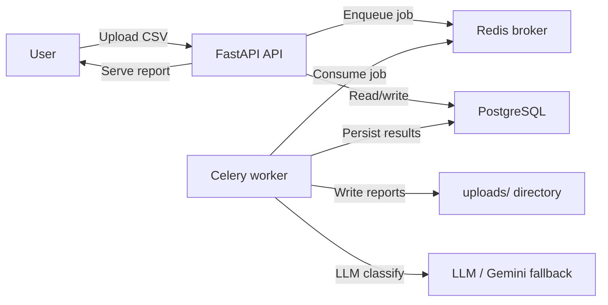

# AI-Powered Transaction Processing Pipeline

A FastAPI backend for ingesting CSV transactions, processing them asynchronously with Celery, classifying categories, detecting anomalies, generating reports, and storing results in PostgreSQL.

## Architecture

The application is composed of:

- `api` — FastAPI service handling uploads, status, results, and report downloads
- `worker` — Celery worker consuming jobs from Redis, persisting transactions, and generating reports
- `postgres` — PostgreSQL database for jobs, transactions, and summaries
- `redis` — Redis broker for Celery task queuing



## Environment

Copy `.env.example` to `.env` and update values for your environment.

```bash
cp .env.example .env
```

Supported env vars:

- `POSTGRES_DB` — PostgreSQL database name
- `POSTGRES_USER` — PostgreSQL user
- `POSTGRES_PASSWORD` — PostgreSQL password
- `DATABASE_URL` — SQLAlchemy database connection string
- `REDIS_URL` — Redis broker URL
- `GEMINI_API_KEY` — optional LLM API key for category classification
- `UPLOAD_MAX_SIZE` — max upload file size in bytes

## Run locally (without Docker)

1. Create and activate a Python 3.12 virtualenv.
2. Install dependencies:

```bash
python -m pip install -r requirements.txt
```

3. Start Redis and Postgres locally, or point `DATABASE_URL` to a running database.
4. Start the API:

```bash
uvicorn app.main:app --host 127.0.0.1 --port 8002
```

5. Start the Celery worker in another terminal:

```bash
celery -A app.workers.celery_app worker --loglevel=info -Q transactions
```

## Docker Compose

Start the full stack:

```bash
docker compose up --build -d
```

The API is exposed on host port `8002`.

Upload a CSV:

```bash
curl -F "file=@transactions.csv;type=text/csv" http://127.0.0.1:8002/jobs/upload
```

Poll status and results:

```bash
curl http://127.0.0.1:8002/jobs/<job_id>/status
curl http://127.0.0.1:8002/jobs/<job_id>/results
```

Download a generated report once the job is completed:

```bash
curl -OJ http://127.0.0.1:8002/jobs/<job_id>/download-report?format=json
```

Supported report formats: `json`, `csv`, `pdf`, `zip`.

## Tests and CI

Run tests locally:

```bash
pytest -q
```

The GitHub Actions workflow runs unit tests and builds Docker images on push and pull request to `main`/`master`.

## Files of interest

- `app/main.py` — FastAPI entrypoint
- `app/api/jobs.py` — job upload, status, results, and report download endpoints
- `app/workers/tasks.py` — Celery job processing and report generation
- `docker-compose.yml` — orchestrates api, worker, postgres, and redis
- `ARCHITECTURE.mmd` — Mermaid architecture diagram source

